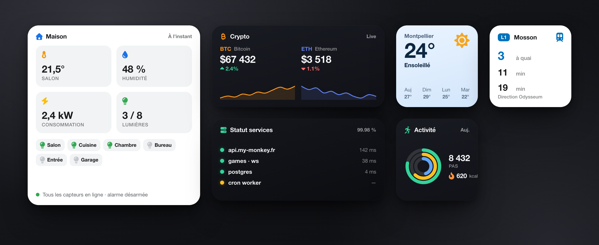
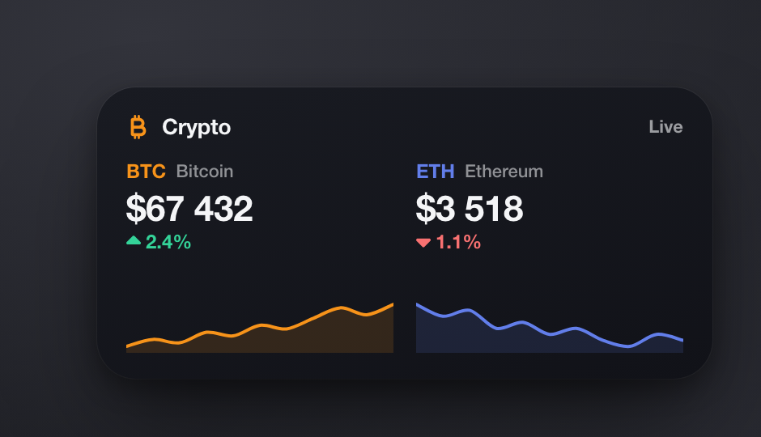
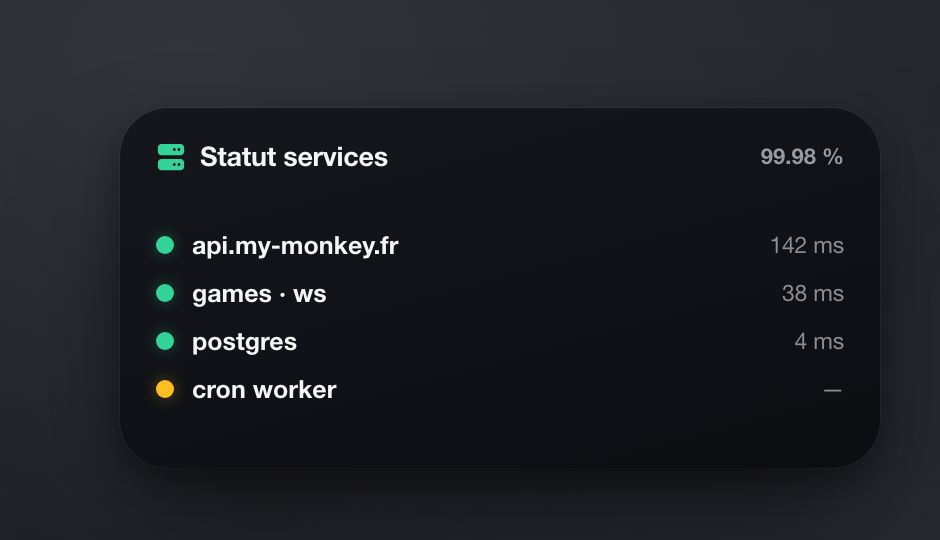
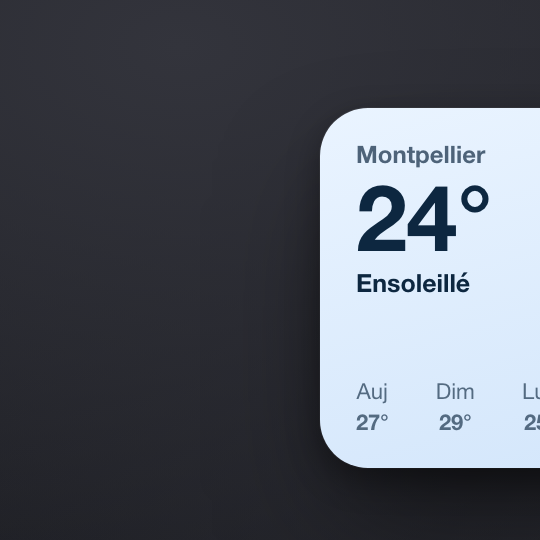
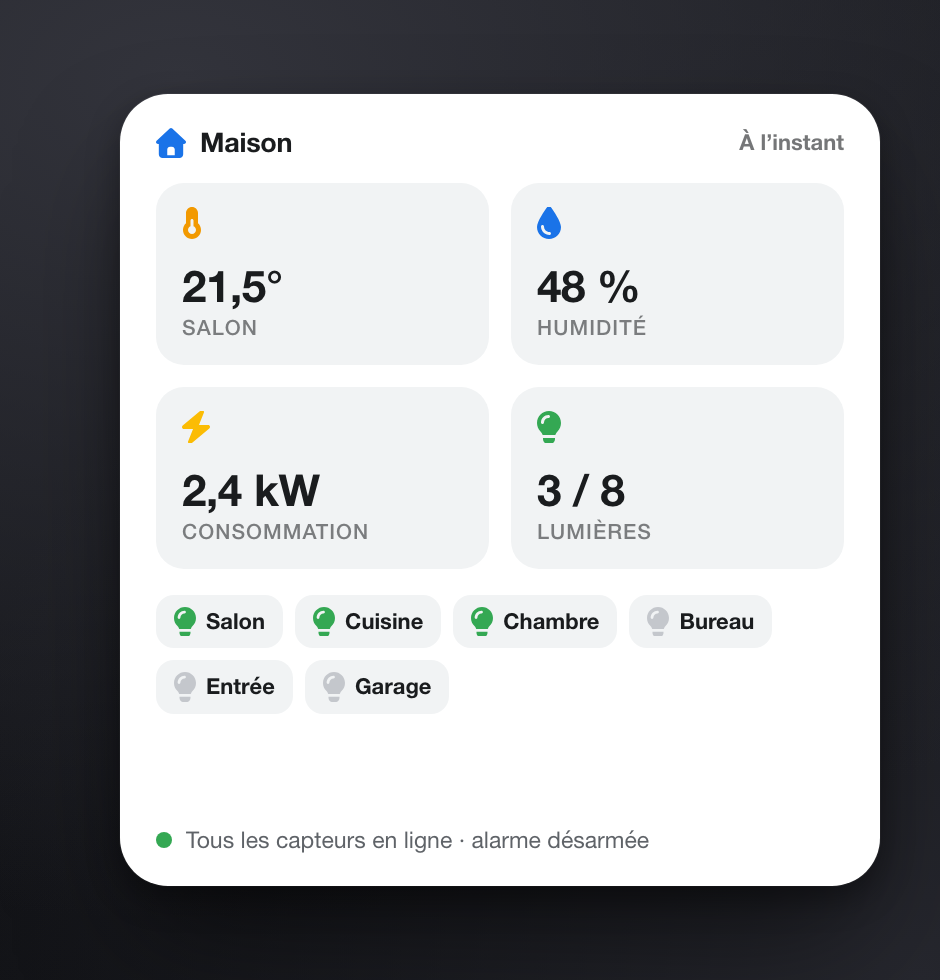
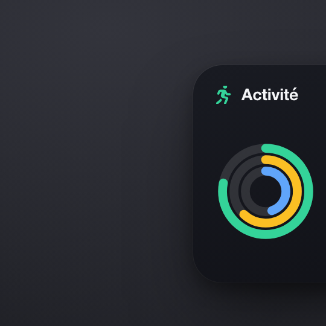
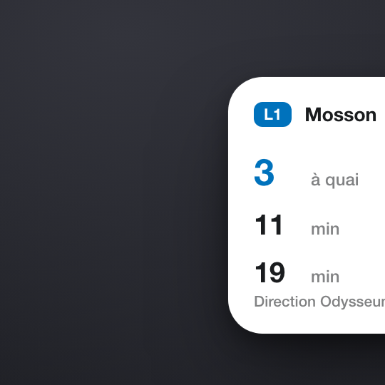
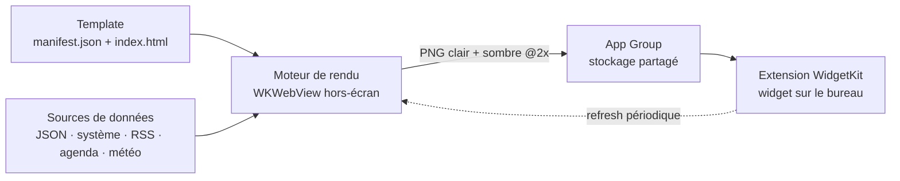

<div align="center">

# Better Widgets

**Créez de vrais widgets macOS à partir de simples templates HTML.**

Vous écrivez du HTML/CSS/JS, Better Widgets le transforme en widget natif WidgetKit
posé sur votre bureau — mis à jour tout seul, en clair et en sombre.



<sub>Exemples ci-dessus générés avec des données de démonstration.</sub>

</div>

---

## L'idée

Les widgets macOS natifs sont puissants mais pénibles à écrire : SwiftUI, cycle de
build, provisioning… Better Widgets renverse le problème. Un widget n'est qu'un
**petit template HTML** :

1. vous décrivez l'écran en HTML/CSS/JS (un `manifest.json` + un `index.html`) ;
2. l'app **récupère les données** que le template demande (API JSON, infos système, RSS, agenda, météo) ;
3. elle **rend le template dans une WKWebView hors-écran** et en fait une **image PNG** (variante claire + sombre) ;
4. l'**extension WidgetKit** affiche cette image comme un vrai widget système.

Résultat : toute la souplesse du web pour dessiner, la légèreté d'un vrai widget natif à l'arrivée.

Inspiré du pattern « on définit un écran en HTML, on l'affiche » — le même que celui qui
alimente les dashboards e-ink et les écrans castés de la galaxie My-Monkey.

## Quelques exemples

Chaque tuile est un template indépendant. Données bidon ici, mais l'idée est là : **branchez
n'importe quelle source et affichez ce que vous voulez.**

<table>
<tr>
<td align="center" width="33%"><br><b>Crypto</b><br><sub>cours + variation 24 h</sub></td>
<td align="center" width="33%"><br><b>Monitoring</b><br><sub>statut & latence des services</sub></td>
<td align="center" width="33%"><br><b>Météo</b><br><sub>conditions + prévisions</sub></td>
</tr>
<tr>
<td align="center"><br><b>Domotique</b><br><sub>température, énergie, lumières</sub></td>
<td align="center"><br><b>Activité</b><br><sub>anneaux, pas, calories</sub></td>
<td align="center"><br><b>Transport</b><br><sub>prochains passages</sub></td>
</tr>
</table>

Autres usages naturels : suivi de colis, stats GitHub, cours de bourse, avancement d'un
objectif, prochain événement d'agenda, **dashboard de votre propre serveur auto-hébergé**…

## Comment ça marche



L'app (une app menu-bar) tient une **seule WKWebView** et une file de rendu sérielle : à
chaque échéance de rafraîchissement, elle refait le PNG et demande à WidgetKit de recharger.
L'extension reste **passive** : elle ne fait que lire le dernier PNG dans l'App Group.

## Écrire un widget

Un template = un dossier avec deux fichiers.

**`manifest.json`** — déclare tailles, fréquence, paramètres et sources :

```json
{
  "id": "hello",
  "name": "Hello",
  "version": "1.0.0",
  "sizes": ["small", "medium"],
  "refresh": 60,
  "params": [{ "key": "city", "type": "string", "label": "Ville", "default": "Montpellier" }],
  "sources": [{
    "key": "wx", "type": "json",
    "config": { "url": "https://api.open-meteo.com/v1/forecast?latitude=43.6&longitude=3.9&current=temperature_2m" }
  }]
}
```

**`index.html`** — lit `window.BW` (injecté avant le rendu) et dessine l'écran :

```html
<!doctype html><meta charset="utf-8">
<style>
  body{font-family:-apple-system;display:grid;place-items:center;height:100vh;margin:0}
  .t{font-size:44px;font-weight:700}
</style>
<div id="root"></div>
<script>
  // window.BW = { params, data, size, theme, stale }
  const { data, params } = window.BW;
  const temp = Math.round(data.wx.current.temperature_2m);
  root.innerHTML = `<div><div class="t">${temp}°</div><div>${params.city}</div></div>`;
</script>
```

Le contrat `window.BW` :

| Champ    | Contenu |
|----------|---------|
| `params` | les valeurs des paramètres du widget (les `{{param}}` sont aussi substitués dans les URLs) |
| `data`   | un objet par source déclarée (`data.wx` ci-dessus = le JSON récupéré) |
| `size`   | `{ w, h, family }` — `family` ∈ `small` / `medium` / `large` |
| `theme`  | `light` ou `dark` (le moteur rend les deux, le système choisit) |
| `stale`  | `true` si la dernière récupération de données a échoué (rendu avec les données précédentes) |

Depuis l'app, on peut aussi éditer les templates dans un **éditeur de code embarqué** (mode
avancé), régler les paramètres avec **aperçu en direct**, et exporter/importer un template
comme fichier **`.bwidget`** (un conteneur JSON auto-décrit).

## Sources de données

| Type       | Ce qu'elle fournit |
|------------|--------------------|
| `json`     | `GET` d'une API JSON (en-têtes custom, secrets d'API en **Keychain**). HTTPS partout, **HTTP toléré vers le réseau privé/local** (serveur perso, LAN, Tailscale) |
| `system`   | infos machine : date/heure, uptime, mémoire, disque |
| `rss`      | dernières entrées d'un flux RSS/Atom |
| `calendar` | prochains événements EventKit (avec consentement) |
| `weather`  | météo WeatherKit par ville ou position courante (avec consentement) |

Les sources sensibles (agenda, météo) passent par un **modèle de permission par widget** ;
tant que l'accès n'est pas accordé, le template reçoit un marqueur au lieu des données.

## Confidentialité & sécurité

- Rendu dans une **WKWebView confinée** : schéma d'assets dédié, navigation `file://` bloquée,
  allowlist stricte.
- Les **secrets d'API** ne vivent que dans le **Keychain** — jamais dans le stockage des widgets,
  jamais dans `window.BW`, jamais dans un export `.bwidget`.
- Import `.bwidget` durci : chaque entrée est validée (whitelist, rejet des chemins absolus/`..`/doublons),
  rien n'est installé si quoi que ce soit est suspect.
- Le HTTP en clair n'est autorisé **que** vers des adresses non routables sur Internet
  (loopback, RFC1918, link-local, CGNAT/Tailscale, `localhost`, `.local`).

## Installer & lancer

> macOS 14+ · Apple Silicon. L'app est signée avec l'identité de développement My-Monkey.

**Build de test prêt à l'emploi** : décompressez `BetterWidgets.app.zip`, glissez `BetterWidgets.app`
dans `/Applications`, lancez-la (au premier lancement : clic droit → *Ouvrir* si Gatekeeper râle).
L'icône apparaît dans la barre de menus. Ajoutez ensuite un widget « Better Widgets » depuis la
galerie de widgets macOS (clic droit sur le bureau → *Modifier les widgets*).

**Depuis les sources** :

```bash
brew install xcodegen          # une fois
xcodegen generate              # génère le .xcodeproj (gitignoré)
open BetterWidgets.xcodeproj   # build & run depuis Xcode
```

Tests :

```bash
xcodegen generate
xcodebuild test -project BetterWidgets.xcodeproj -scheme BetterWidgets -destination 'platform=macOS'
```

## Sous le capot

| | |
|---|---|
| **Interface** | SwiftUI, app menu-bar (`LSUIElement`) |
| **Widgets** | WidgetKit — tailles `small` / `medium` / `large` |
| **Rendu** | WKWebView hors-écran → snapshot PNG @2x (clair + sombre) |
| **Partage app ↔ extension** | App Group (`instances.json`, PNG rendus, état par widget) |
| **Données** | providers `json` / `system` / `rss` / `calendar` (EventKit) / `weather` (WeatherKit) |
| **Éditeur** | CodeMirror embarqué (vendoré, zéro CDN au runtime) |
| **Projet** | XcodeGen (le `.xcodeproj` est généré, pas commité) · 131 tests |

## État

Le cœur est là : moteur de rendu, providers, permissions, interface de gestion, éditeur de
code, aperçu en direct, import/export `.bwidget`. La prochaine étape est un lot de **templates
maison** soignés et une **distribution** propre (DMG notarisé + cask Homebrew).

---

<div align="center"><sub>Un projet <a href="https://my-monkey.fr">My-Monkey</a> 🍌</sub></div>
